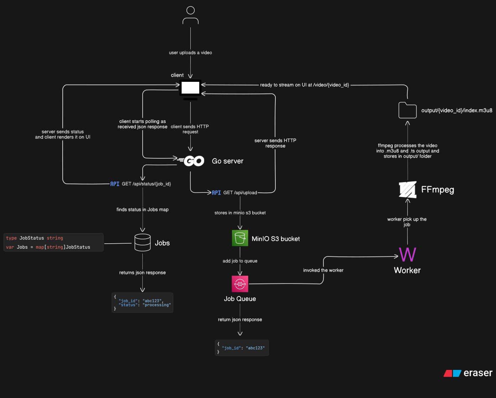

# 🎬 Media Processing Pipeline

A distributed, asynchronous Video-on-Demand (VoD) processing system built in Go, designed to handle large video uploads, process them into HLS streams, and deliver them efficiently for playback.

---

## 🚀 Overview

This project simulates a real-world media processing pipeline used by platforms like Netflix, YouTube, and Twitch.

It takes a raw video file as input, processes it in the background using FFmpeg, converts it into HLS segments, and makes it available for streaming via a frontend UI.

The system is built with scalability, decoupling, and observability in mind.

---

## ⚡ Core Features

### 🔹 Backend

* Upload video files via HTTP API
* Store files in MinIO (S3-compatible object storage)
* Asynchronous job processing using Go channels
* Worker pool for concurrent processing
* FFmpeg integration for HLS (m3u8 + .ts) generation
* Job status tracking (pending → processing → completed/failed)
* REST API for job status polling
* Clean architecture using dependency injection (DI)

### 🔹 Frontend

* Built using Vite + Vanilla TypeScript (no frameworks)
* SPA (Single Page Application) with custom router
* Component-based rendering system (custom abstraction)
* Real-time status updates via polling
* Dynamic video playback using HLS.js
* Improved UX:

  * Upload button disabled during upload
  * Status feedback (uploading, processing, completed, failed)
  * Watch button appears only when processing is complete
  * Direct access to `/video/:id` supported

---

## 🧠 Problem Statement

Traditional video delivery using progressive download is inefficient:

* Consumes high bandwidth
* Doesn't adapt to network conditions
* Blocks server during heavy uploads and processing

---

## 💡 Solution Approach

This system solves the problem using:

### 1. Asynchronous Processing

Video processing is offloaded to background workers using a queue-worker model.

### 2. HLS Streaming

Videos are converted into:

* `.m3u8` playlist
* `.ts` segments

This enables:

* Adaptive bitrate streaming (ABR-ready)
* Smooth playback on unstable networks

### 3. Decoupled Architecture

The system separates:

* Upload (Ingest)
* Processing (Workers)
* Delivery (Streaming)

---

## 🏗️ Architecture


### Architecture Flow:

> This system follows an asynchronous, event-driven pipeline:

```text
Client (Frontend - Vite)
        ↓
Go API Server (Upload + Status)
        ↓
MinIO (Object Storage)
        ↓
Job Queue (Channel)
        ↓
Worker Pool (Goroutines)
        ↓
FFmpeg Processing
        ↓
HLS Output (m3u8 + ts)
        ↓
Frontend Playback (HLS.js)
```

### Architecture Diagram:

> ⚙️ The system is designed using a queue-worker architecture to decouple upload, processing, and delivery.

<p align="center">
    
</p>

---

## 📦 Tech Stack

### Backend

| Category | Technology | Name | Purpose |
|---|---|---|---|
| Language | | Go | Core backend logic and concurrency handling |
| Media Processing |  | FFmpeg | Transcoding videos into HLS format (.m3u8 + .ts segments) |
| Storage |  | MinIO | S3-compatible object storage for video files |
| HTTP Server | `net/http` | net/http | Handling HTTP requests and building APIs |
| Containerization |  | Docker | Containerization and deployment |
| Scripting |  | Python | Utility scripts (testing, automation, cleanup) |
| Scripting |  | Bash | CLI automation and environment setup |

### Frontend

| Category | Technology | Name | Purpose |
|---|---|---|---|
| Language |  | TypeScript | Client-side logic and type safety |
| Build Tool |  | Vite | Fast development server and build system |
| Streaming | `Hls.js` | HLS.js | Playback of HLS streams in browser |

### Testing

* Unit tests (mock-based)
* Integration tests (testcontainers + MinIO)
* End-to-end tests (full pipeline)

---

## 🔄 System Workflow

1. User uploads video via UI
2. Backend stores video in MinIO
3. A job is created and pushed to queue
4. Worker picks up job and starts processing
5. FFmpeg converts video into HLS segments
6. Job status updates continuously
7. Frontend polls status API
8. When complete → user can stream video

---

## 🧪 Testing Strategy

| Type            | Tools/Approach                | Purpose |
|-----------------|------------------------------|--------|
| Unit Testing    | Go testing + mocks           | Test isolated business logic |
| Integration     | testcontainers + MinIO       | Test real storage interactions |
| End-to-End      | Full pipeline tests          | Validate complete workflow |

---

## 🛠️ Development Setup

### Backend

```bash
docker compose up --build -d # spin up infrastructure
go run cmd/api/main.go # run go server
```

### Frontend

```bash
cd web
npm install # install dependencies
npm run dev # run vite's dev server
```

---

## 🔐 API Endpoints

### Upload Video

```
POST /api/upload
```

Response:

```json
{
  "job_id": "abc123"
}
```

---

### Get Job Status

```
GET /api/status/{job_id}
```

Response:

```json
{
  "job_id": "abc123",
  "status": "processing"
}
```

---

### Stream Video

**Backend**:

```
GET /api/stream/
```

Response: `index.m3u8` playlist

**Frontend**:

fetch `index.m3u8` playlist

```html
<video src="http://localhost:8080/api/stream/{video_id}/index.m3u8" controls></video>
```

on:

```
GET /video/{video_id}
```

---

## 🚧 Future Improvements

* Progress tracking (percentage-based processing)
* Adaptive bitrate streaming (multi-quality HLS)
* CDN integration for global delivery
* Retry mechanism for failed jobs
* WebSocket-based real-time updates (instead of polling)
* Authentication & rate limiting

---

## 🧠 Key Learnings

* Building distributed systems using Go concurrency
* Designing queue-worker architectures
* Understanding video processing pipelines
* Implementing HLS streaming from scratch
* Creating frontend abstractions without frameworks
* Managing fullstack system integration

---

## ⚠️ Notes

* CORS is currently enabled for local development
* Can be replaced with proxy-based setup in production
* Frontend and backend run independently

---

## Documentations

* [API Documentation](docs/API.md)

## 🔥 Final Thought

This project is not just about video processing —
it's about understanding how real-world scalable systems are designed, built, and optimized.

---
