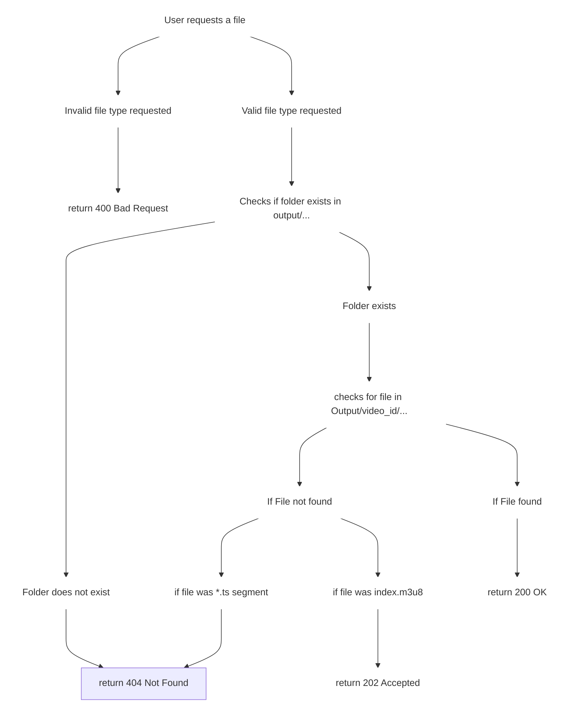

# API Documentation

This document describes the HTTP API for the current backend-first version of the media processing pipeline. The API is intended to be consumed by clients such as Postman, Requestly, curl, or other custom integrations.

## APIs

### 1. Upload Video API
> Accepts a video file upload, stores it in MinIO, and creates a background transcoding job.

**API Endpoint**: `POST /api/upload`

**Request Body**: Multipart form data containing the video file.

**Response**:

* `200 OK`: Video successfully uploaded, stored in MinIO, and queued for processing.
```json
{
    "success": true,
    "data": {
        "video_id": "7cf83c8d-89e8-4155-b731-f993b0c8c2b4",
        "job_id": "79751652-2ea3-4cc6-a424-a30b5687a38d",
        "status": "pending",
        "metadata": {
            "filename": "sample_video.mp4",
            "size_bytes": 97329817,
            "content_type": "video/mp4"
        },
        "links": {
            "status_url": "http://localhost:8080/api/status/79751652-2ea3-4cc6-a424-a30b5687a38d",
            "stream_url": "http://localhost:8080/api/stream/7cf83c8d-89e8-4155-b731-f993b0c8c2b4/index.m3u8",
            "video_url": "http://localhost:5173/video/7cf83c8d-89e8-4155-b731-f993b0c8c2b4"
        },
        "created_at": "2026-08-03T13:08:22.6436135+05:30"
    }
}
```

**Error Responses:**

* `500 Internal Server Error`: An error occurred while parsing the form data, accessing the uploaded file, verifying the content type, or storing the video in MinIO.

* `415 Unsupported Media Type Error`: The uploaded file is not a supported video type.


**API Logic Flow**:
```mermaid
graph TD

    classDef UploadVideoAPI fill:transparent,stroke:#fff,stroke-width:1px;

    upload[Upload Video]
    parse[Parse Multipart Form Data]
    parseError[If error parsing form data]
    accessVideo[Access Video File]
    accessError[If error accessing video file]
    verifyFile[Verify File Content Type]
    verifyError[If error verifying file content type]
    store["Store Video in MinIO S3 Bucket (Ingestion)"]
    storeError[If error storing video]
    job["Create and submit Job to Queue (Worker Pool)"]
    SuccessRes[Return Upload Response]
    ErrorRes500[Return 500 internal server error]
    ErrorRes415[Return 415 unsupported media type error]

    CorrectContentType[Correct Content Type]
    IncorrectContentType[Incorrect Content Type]

    upload --> parse

    parse ---> parseError ---> ErrorRes500

    parse ---> accessVideo

    accessVideo ---> accessError ---> ErrorRes500

    accessVideo ---> verifyFile

    verifyFile ---> verifyError ---> ErrorRes500

    verifyFile ---> IncorrectContentType ---> ErrorRes415

    verifyFile ---> CorrectContentType ---> store

    store ---> storeError ---> ErrorRes500

    store ---> job

    job ---> SuccessRes


    class upload,parse,parseError,accessVideo,accessError,store,storeError,job,SuccessRes,ErrorRes500,ErrorRes415,CorrectContentType,IncorrectContentType,verifyFile,verifyError UploadVideoAPI
```

### 2. Job Status API

> Returns the current lifecycle state of a processing job using its job ID.

**API Endpoint**: `GET /api/status/{job_id}`

**Request Parameters**: `job_id`: The ID of the job to fetch the status for.

**Response**: 

* `200 OK`: Job status successfully fetched and returned.
```json
{
    "success": true,
    "data": {
        "job_id": "79751652-2ea3-4cc6-a424-a30b5687a38d",
        "status": "completed",
        "payload": {
            "video_id": "7cf83c8d-89e8-4155-b731-f993b0c8c2b4"
        },
        "timings": {
            "created_at": "2026-08-03T13:08:22.6436135+05:30",
            "started_at": "2026-08-03T13:08:22.6441205+05:30",
            "finished_at": "2026-08-03T13:10:02.5666033+05:30",
            "duration": "1m39.9240716s",
            "queue_wait": "507µs"
        },
        "error": "",
        "is_finished": true
    }
}

```

**Error Responses:**

* `404 Not Found`: The job with the specified ID was not found.

**API Logic Flow**:
```mermaid
graph TD

    classDef JobStatusAPI fill:transparent,stroke:#fff,stroke-width:1px;

    A[(Jobs map)] 
    B[Fetch Job from Map]
    C[Job found]
    D[Job not found]
    E[Return 200 Job Status Res]
    F[Return 404 Job not found]


    A --> B
    B ---> C
    B ---> D
    C --> E
    D --> F

    class A,B,C,D,E,F JobStatusAPI
```

### 3. Stream Video API

> Serves the generated HLS playlist or segment files for a processed video.

**API Endpoint**: `GET /api/stream/{video_id}/{file_name}`

**Request Parameters**:

* `video_id`: The ID of the video to stream.
* `file_name`: The name of the file to stream. By default, it is set to "index.m3u8". It can be a ".ts" file to stream a specific segment.

**Response**: 

* `200 OK`: HLS playlist or requested segment file successfully fetched and returned.
```
#EXTM3U
#EXT-X-VERSION: 3
#EXT-X-TARGETDURATION: 8
#EXT-X-MEDIA-SEQUENCE: 0
#EXTINF: 8.400000,
index0.ts
#EXTINF: 6.800000,
index1.ts
#EXTINF: 5.200000,
index2.ts
#EXTINF: 6.960000,
index3.ts
#EXTINF: 6.080000,
index4.ts
#EXTINF: 4.960000,
index5.ts
#EXTINF: 4.600000,
index6.ts
#EXT-X-ENDLIST
```
* `202 Accepted`: The video is currently being processed or master playlist is being generated.
```json
{
    "success": true,
    "data": {
        "video_id": "38016fa5-b3f6-4370-8783-591177ace881",
        "status": "processing",
        "message": "Master playlist is being generated. Please retry",
        "code": 202
    }
}
```

**Error Responses:**

* `400 Bad Request`: An error occurred due to invalid requested file type.

* `404 Not Found`: The video with the specified ID was not found or the requested segment is not available yet.


**API Logic Flow**:


### 4. Job API

> Returns full details for a single job, including its status, timestamps, payload, and errors.

**API Endpoint**: `GET /api/job/{job_id}`

**Request Parameters**:

* `job_id`: The ID of the job to fetch details for.

**Response**:

* `200 OK`: Job details successfully fetched and returned.
```json
{
    "success": true,
    "data": {
        "job_id": "5a2a4291-25ba-4aa4-9ae7-60fcc579d018",
        "job_type": "transcoding",
        "payload": {
            "video_id": "301cc10d-54b9-430b-83f8-8ab08b787e54"
        },
        "status": "completed",
        "created_at": "2026-08-03T15:08:51.472676+05:30",
        "started_at": "2026-08-03T15:08:51.4731879+05:30",
        "finished_at": "2026-08-03T15:10:35.2137092+05:30",
        "error": ""
    }
}
```

**Error Response**:

* `404 Not Found`: The job with the specified ID was not found.

**API Logic Flow**:
```mermaid
graph TD

    classDef JobStatusAPI fill:transparent,stroke:#fff,stroke-width:1px;

    A[(Jobs map)] 
    B[Fetch Job from Map]
    C[Job found]
    D[Job not found]
    E[Return 200 Job Status Res]
    F[Return 404 Job not found]


    A --> B
    B ---> C
    B ---> D
    C --> E
    D --> F

    class A,B,C,D,E,F JobStatusAPI
```

### 5. Jobs API

> Returns the list of jobs currently known by the service.

**API Endpoint**: `GET /api/jobs`

**Response**:

* `200 OK`: List of jobs successfully fetched and returned.
```json
{
    "success": true,
    "data": [
        {
            "id": "f55ea35a-6c00-4444-b573-6906e226f5a8",
            "type": "transcoding",
            "payload": {
                "video_id": "54567b90-2123-4ed6-a357-0719b68f4703"
            },
            "status": "completed",
            "created_at": "2026-08-03T14:46:30.2816261+05:30",
            "started_at": "2026-08-03T14:46:30.2816261+05:30",
            "finished_at": "2026-08-03T14:48:05.554774+05:30",
            "last_error": ""
        },
        {
            "id": "5a2a4291-25ba-4aa4-9ae7-60fcc579d018",
            "type": "transcoding",
            "payload": {
                "video_id": "301cc10d-54b9-430b-83f8-8ab08b787e54"
            },
            "status": "completed",
            "created_at": "2026-08-03T15:08:51.472676+05:30",
            "started_at": "2026-08-03T15:08:51.4731879+05:30",
            "finished_at": "2026-08-03T15:10:35.2137092+05:30",
            "last_error": ""
        },
        {
            "id": "730ab036-8450-48f2-9be9-b5293336b163",
            "type": "transcoding",
            "payload": {
                "video_id": "38016fa5-b3f6-4370-8783-591177ace881"
            },
            "status": "completed",
            "created_at": "2026-08-03T15:41:08.9644551+05:30",
            "started_at": "2026-08-03T15:41:08.9644551+05:30",
            "finished_at": "2026-08-03T15:43:00.8743615+05:30",
            "last_error": ""
        }
    ]
}
```