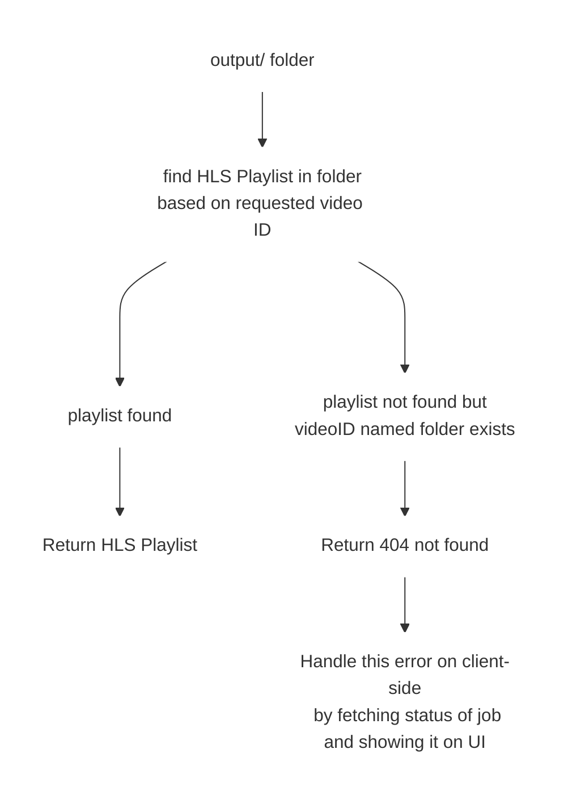

# API Documentation

## APIs

### 1. Upload Video API
> It handles the upload of video files to the server, parsing multipart form data, storing the video in MinIO, and creating a job for processing.

**API Endpoint**: `POST /api/upload`

**Request Body**: Multipart form data containing the video file.

**Response**: 

* `200 OK`: Video successfully uploaded and stored in MinIO.
```json
{
    "video_id": "abc123"
}
```

* `500 Internal Server Error`: An error occurred while storing the video in MinIO.

* `400 Bad Request Error`: An error occurred while parsing the multipart form data or accessing the video file.


**API Logic Flow**:
```mermaid
graph TD

    classDef UploadVideoAPI fill:transparent,stroke:#fff,stroke-width:1px;

    upload[Upload Video]
    parse[Parse Multipart Form Data]
    parseError[If error parsing form data]
    accessVideo[Access Video File]
    accessError[If error accessing video file]
    store[Store Video in MinIO S3 Bucket]
    storeError[If error storing video]
    job["Create and submit Job to Queue (Worker Pool)"]
    SuccessRes[Return Video ID]
    ErrorRes500[Return 500 internal server error]
    ErrorRes400[Return 400 bad request error]

    upload --> parse

    parse ---> parseError ---> ErrorRes400

    parse ---> accessVideo

    accessVideo ---> accessError ---> ErrorRes400

    accessVideo ---> store

    store ---> storeError ---> ErrorRes500

    store ---> job

    job ---> SuccessRes


    class upload,parse,parseError,accessVideo,accessError,store,storeError,job,SuccessRes,ErrorRes500,ErrorRes400 UploadVideoAPI
```

### 2. Job Status API

> It fetches the status of a job based on its ID and returns a JSON response containing the job id and status.

**API Endpoint**: `GET /api/status/{job_id}`

**Response**: 

* `200 OK`: Job status successfully fetched and returned.
```json
{
    "job_id": "abc123",
    "status": "processing"
}
```

* `404 Not Found`: The job with the specified ID was not found.

**API Logic Flow**:
```mermaid
graph TD

    classDef JobStatusAPI fill:transparent,stroke:#fff,stroke-width:1px;

    A[(Jobs map)] 
    B[Fetch Job Status from Map]
    C[Job found]
    D[Job not found]
    E[Return Job Status with ID]
    F[Return 404 not found]


    A --> B
    B ---> C
    B ---> D
    C --> E
    D --> F

    class A,B,C,D,E,F JobStatusAPI
```

### 3. Stream Video API

> It fetches the HLS playlist for a video based on its ID and returns an `index.m3u8` playlist.

**API Endpoint**: `GET /api/stream/{video_id}/index.m3u8`

**Response**: 

* `200 OK`: HLS playlist successfully fetched and returned.
* `404 Not Found`: The video with the specified ID was not found.

**API Logic Flow**:
