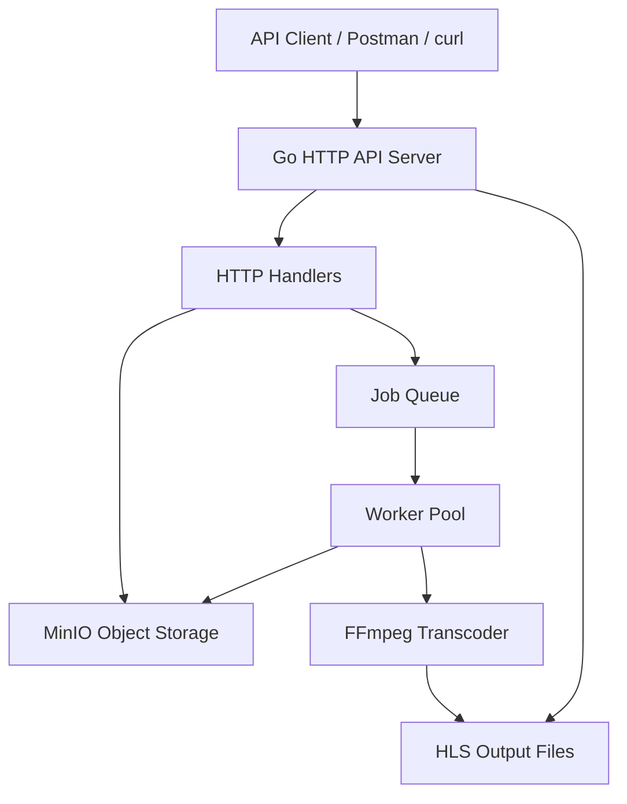
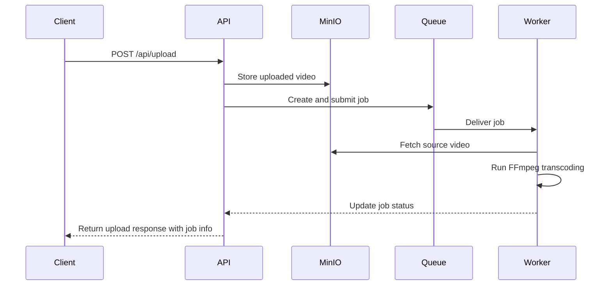
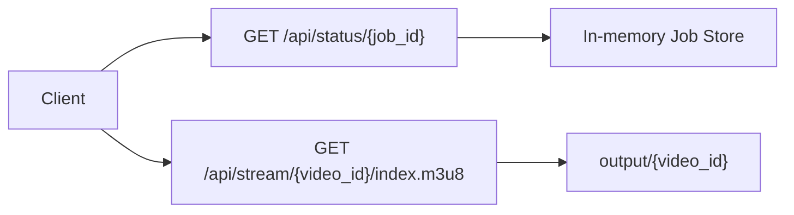

# Architecture Overview

## 1. Purpose

This project implements a small but practical media processing pipeline for uploading videos, processing them asynchronously into HLS-compatible output, and exposing the resulting media through HTTP endpoints.

The system is designed around four major concerns:

- ingesting uploaded videos through API requests
- creating background jobs for processing
- transcoding media with FFmpeg into HLS segments
- exposing status and streaming endpoints for API clients such as Postman, Requestly, and curl

---

## 2. High-Level Architecture

The application follows a layered, event-driven architecture with a queue-worker pattern.

---

## 3. System Components

### 3.1 API Clients

In v1.0.0, the system is intended to be consumed directly by API clients rather than a dedicated frontend dashboard.

Examples of consumers include:

- Postman
- Requestly
- curl
- any custom HTTP client or mobile/web app in the future

These clients interact with the API through the exposed upload, status, job, and stream endpoints.

### 3.2 Backend API Server

The backend is a Go-based HTTP server started from cmd/api/main.go.

Responsibilities:

- accept video uploads
- validate input and content type
- store uploaded files in MinIO
- create and submit background jobs
- expose endpoints for job status and HLS streaming

The server uses the standard net/http package with a multiplexer and CORS middleware.

### 3.3 Handler Layer

The handlers package contains the request-facing logic for each route:

- **UploadHandler**: receives multipart uploads, validates the file type, stores it in MinIO, and creates a job
- **StatusHandler**: returns the current state of a job including timestamps and error information
- **JobHandler**: returns the job details
- **JobsHandler**: returns the list of known jobs
- **StreamHandler**: serves the HLS playlist or segment files from the output directory

### 3.4 Job and Queue Model

The core processing flow is based on jobs.

A job contains:

- unique job ID
- job type
- payload with the video ID
- lifecycle status such as pending, processing, completed, or failed
- timestamps for creation, start, and completion
- error information when processing fails

The queue is implemented as an in-memory channel-based queue with bounded capacity. Jobs are submitted to the queue and workers pull them from it.

### 3.5 Worker Pool

The worker pool is the asynchronous execution engine.

It performs the following tasks:

- start a fixed number of goroutines
- receive jobs from the queue
- mark jobs as processing
- download the source video from MinIO
- invoke FFmpeg to generate HLS output
- update the job state to completed or failed

This layer is the heart of the system because it decouples upload from transcoding.

### 3.6 Storage Layer

MinIO is used as an S3-compatible object store.

Responsibilities:

- store raw uploaded video files
- act as the source for transcoding jobs
- provide object access for the worker layer

### 3.7 Output Layer

After transcoding, FFmpeg writes output into the output directory.

Typical output contains:

- index.m3u8
- segment files such as index0.ts, index1.ts, and so on

The stream endpoint serves these files to clients that want to consume the generated HLS playlist or segments.

---

## 4. Request Flow

### 4.1 Upload Flow

### 4.2 Status and Playback Flow

---

## 5. Runtime and Deployment Model

The project is currently designed for local development and small-scale deployment.

### Runtime components

- Go API server on port 8080
- MinIO on ports 9000 and 9001
- API clients such as Postman, Requestly, curl, or custom integrations

### Infrastructure setup

The docker-compose file provisions MinIO as a containerized object store.

This makes it easy to run the storage layer without depending on a cloud provider during development.

---

## 6. Data Model

### Job

The central domain entity is the job. It tracks the lifecycle of each processing request.

Fields include:

- ID
- type
- payload
- status
- createdAt
- startedAt
- finishedAt
- lastError

### Payload

The payload currently carries a single key:

- video_id

This identifier is used to map the job to the uploaded object and HLS output folder.

---

## 7. Design Characteristics

### Strengths

- clear separation between upload, processing, and streaming concerns
- asynchronous processing prevents blocking the API during transcoding
- queue-worker design is easy to extend for multiple workers
- simple integration with MinIO and FFmpeg

### Current limitations

- jobs and queue state are kept in memory, so they are not persistent across restarts
- the system is not yet production-hardened for high-scale concurrency
- there is no authentication, retry policy, or dead-letter queue yet
- the worker uses the local filesystem and local FFmpeg installation

---

## 8. Technology Stack

### Backend

- Go
- net/http
- MinIO Go SDK
- FFmpeg
- Docker Compose

### API / Client Layer

- HTTP clients such as Postman, Requestly, or curl
- future frontend/dashboard integrations can be layered on top of the same API

### Testing

- Go unit and integration tests
- end-to-end pipeline tests

---

## 9. Suggested Evolution

As the project grows, the architecture can evolve in the following ways:

- introduce a persistent message broker such as RabbitMQ or Kafka
- move the job state to a database instead of an in-memory store
- add retries and failure handling for transcoding jobs
- add authentication and authorization
- add observability with logs, metrics, and tracing
- support adaptive bitrate streaming and multi-quality outputs

---

## 10. Summary

The current architecture is a lightweight, practical pipeline for video ingestion and HLS transcoding. It uses a Go backend, MinIO storage, an in-memory job queue, a worker pool, and HTTP endpoints to provide end-to-end upload, processing, status tracking, and streaming capabilities for API-driven clients.
